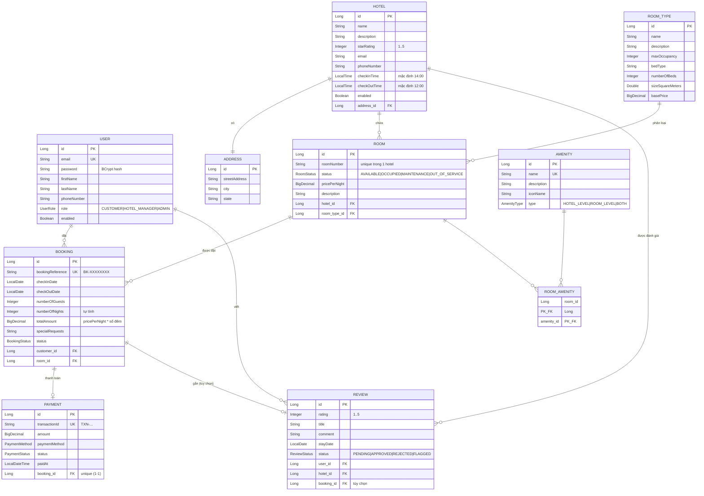

# HotelBooking — Tài liệu kiến trúc & luồng hoạt động

Tài liệu mô tả kiến trúc tổng thể, các luồng nghiệp vụ chính và logic phân quyền của hệ thống đặt phòng khách sạn.

---

## 1. Tổng quan

- **Stack**: Spring Boot (Java 17), Spring Data JPA, Spring Security, Redis, PostgreSQL (H2 cho test), springdoc-openapi (Swagger).
- **Kiến trúc phân lớp**: `Controller → Service → Repository → Entity`.
  - **Controller**: nhận HTTP request, validate DTO (`@Valid`), gọi service, trả `ResponseEntity`.
  - **Service**: chứa logic nghiệp vụ + kiểm tra phân quyền chi tiết theo chủ sở hữu; đánh dấu `@Transactional`.
  - **Repository**: Spring Data JPA, truy vấn dữ liệu.
  - **Entity**: ánh xạ bảng, kế thừa `BaseEntity` (id + audit timestamps).
- **DTO**: request/response tách biệt entity. Không bao giờ trả entity trực tiếp ra ngoài (tránh lộ quan hệ lazy, vòng lặp JSON).

### Cấu trúc package

```
com.example.hotelbooking
├── config          # Security, JPA auditing, Redis, OpenAPI, seed data
├── controller      # REST endpoints
├── exception       # Exception tùy biến + GlobalExceptionHandler
├── model
│   ├── base        # BaseEntity (id, createdAt, updatedAt)
│   ├── dto/request # DTO đầu vào (có validation)
│   ├── dto/response# DTO đầu ra
│   ├── entity      # JPA entities
│   └── enums       # Các enum trạng thái/loại
├── repository      # Spring Data JPA repositories
└── service         # Business logic (+ impl cho Auth/Jwt)
```

---

## 2. Mô hình dữ liệu

### 2.1. Sơ đồ quan hệ thực thể (ERD)

Sơ đồ Mermaid (GitHub / IntelliJ render trực tiếp):



Bản ASCII xem nhanh (đọc mũi tên: `1 ──< N` nghĩa là "một-nhiều", `1 ──1` là "một-một"):

```
                 ┌──────────┐
                 │  ADDRESS │
                 └────▲─────┘
                      │ 1-1
   1-N   ┌──────────┐ │        1-N    ┌───────────┐
 ┌──────<│  HOTEL   │─┘   ┌──────────<│ ROOM_TYPE │
 │       └────┬─────┘     │           └───────────┘
 │            │ 1-N       │
 │            ▼           │
 │       ┌──────────┐     │
 │  ┌───<│   ROOM   │>────┘
 │  │    └────┬─────┘
 │  │         │ N-N (qua ROOM_AMENITY)
 │  │         ▼
 │  │    ┌──────────────┐      ┌──────────┐
 │  │    │ ROOM_AMENITY │>─────│ AMENITY  │
 │  │    └──────────────┘  N-N └──────────┘
 │  │
 │  │ 1-N (Room được đặt nhiều lần)
 │  ▼
 │ ┌──────────┐   1-1   ┌──────────┐
 │ │ BOOKING  │────────>│ PAYMENT  │
 │ └────┬─────┘         └──────────┘
 │      │ 1-1 (tùy chọn, review gắn 1 booking)
 │      ▼
 │ ┌──────────┐
 └>│  REVIEW  │<──┐
   └────▲─────┘   │ 1-N
        │ 1-N     │
   ┌────┴─────────┴┐
   │     USER      │  (đặt Booking + viết Review; Hotel cũng 1-N Review)
   └───────────────┘
```

**Điểm cần nhớ khi đọc ERD**:
- `Hotel` và `Address` là **hai bảng riêng**, nối 1-1 qua FK `address_id` (Hotel giữ khóa ngoại, cascade ALL — xóa hotel xóa luôn address).
- `Room ↔ Amenity` là quan hệ **nhiều-nhiều**, hiện thực bằng bảng nối `ROOM_AMENITY` với **khóa chính kép** (`room_id` + `amenity_id`, dùng `@IdClass`).
- `Booking ↔ Payment` là **1-1** (mỗi đơn tối đa một payment; `booking_id` unique).
- `Review` có FK `booking_id` **tùy chọn** (nullable): có thể đánh giá kèm booking hoặc đánh giá "trơn".
- Mọi entity kế thừa `BaseEntity` nên đều có thêm `id`, `createdAt`, `updatedAt` (không vẽ lại cho gọn).

### 2.2. Bảng thực thể

| Entity | Vai trò | Quan hệ chính |
|--------|---------|----------------|
| `User` | Người dùng (implements `UserDetails`) | 1-N `Booking`, 1-N `Review` |
| `Hotel` | Khách sạn | 1-1 `Address` (FK `address_id`), 1-N `Room`, 1-N `Review` |
| `RoomType` | Loại phòng (giá cơ bản, sức chứa) | 1-N `Room` |
| `Room` | Phòng cụ thể trong khách sạn | N-1 `Hotel`, N-1 `RoomType`, N-N `Amenity` qua `RoomAmenity` |
| `Amenity` | Tiện nghi | N-N `Room` qua `RoomAmenity` |
| `RoomAmenity` | Bảng nối Room ↔ Amenity | khóa chính kép (`IdClass`) |
| `Booking` | Đơn đặt phòng | N-1 `User`, N-1 `Room`, 1-1 `Payment` |
| `Payment` | Thanh toán cho một booking | 1-1 `Booking` |
| `Review` | Đánh giá khách sạn | N-1 `User`, N-1 `Hotel`, tùy chọn 1-1 `Booking` |

### Audit timestamp

`BaseEntity` dùng `@CreatedDate` / `@LastModifiedDate`. Cơ chế này được kích hoạt bởi `@EnableJpaAuditing` trong `JpaConfig`. **Nếu thiếu annotation này, mọi lần lưu entity sẽ fail vì `created_at` NULL** — đây là điểm cấu hình bắt buộc.

### Các enum trạng thái

- `UserRole`: `CUSTOMER`, `HOTEL_MANAGER`, `ADMIN`
- `RoomStatus`: `AVAILABLE`, `OCCUPIED`, `MAINTENANCE`, `OUT_OF_SERVICE`
- `BookingStatus`: `PENDING → CONFIRMED → CHECKED_IN → CHECKED_OUT`, hoặc `CANCELLED` / `NO_SHOW`
- `PaymentStatus`: `PENDING`, `PROCESSING`, `COMPLETED`, `FAILED`, `REFUNDED`, `PARTIALLY_REFUNDED`
- `PaymentMethod`: `CREDIT_CARD`, `DEBIT_CARD`, `PAYPAL`, `BANK_TRANSFER`, `CASH`
- `ReviewStatus`: `PENDING` (chờ duyệt), `APPROVED` (hiển thị công khai), `REJECTED` (từ chối), `FLAGGED` (bị gắn cờ)
- `AmenityType`: `HOTEL_LEVEL`, `ROOM_LEVEL`, `BOTH`

---

## 3. Bảo mật & phân quyền

### 3.1. Kiến trúc xác thực (JWT stateless)

```
Client                    Server
  │  POST /auth/login        │
  │─────────────────────────>│  AuthenticationManager xác thực (BCrypt)
  │                          │  JwtService sinh access + refresh token
  │  {accessToken,           │  refresh token: lưu jti vào Redis (TTL)
  │   refreshToken}          │
  │<─────────────────────────│
  │                          │
  │  GET /api/... (Bearer)   │
  │─────────────────────────>│  JwtAuthenticationFilter:
  │                          │   - verify chữ ký + hạn
  │                          │   - ép đúng loại ACCESS_TOKEN
  │                          │   - set SecurityContext (username + roles)
  │<─────────────────────────│
```

- **Session STATELESS**: không có HttpSession, mỗi request tự mang token.
- **`JwtAuthenticationFilter`** (chạy trước `UsernamePasswordAuthenticationFilter`): đọc header `Authorization: Bearer <token>`. Token hợp lệ → set `SecurityContext`. Token hỏng/hết hạn → **không chặn ngay**, để `SecurityFilterChain` quyết định (endpoint public vẫn qua, endpoint cần auth trả 401).
- **`User` implements `UserDetails`**: `getUsername()` trả email, `getAuthorities()` trả `ROLE_<role>`.

### 3.2. Refresh token rotation + reuse detection

- Mỗi refresh token có một `jti` (định danh riêng), được lưu vào Redis với key `refresh:{userId}:{jti}`, TTL = hạn refresh token.
- Refresh token chỉ hợp lệ khi **jti của nó còn tồn tại trong Redis**.
- **Luồng refresh** (`POST /auth/refresh`):
  1. Parse + verify refresh token.
  2. Kiểm tra jti còn trong Redis không.
     - Nếu **không còn** → token đã dùng rồi hoặc bị đánh cắp → **revoke toàn bộ phiên của user** (`revokeAllRefreshTokens`) và bắt đăng nhập lại.
  3. Nếu hợp lệ → revoke jti cũ (rotation) + phát hành cặp token mới.
- **Logout** (`POST /auth/logout`): parse refresh token, xóa jti khỏi Redis. Idempotent — token đã hỏng vẫn trả 204.

### 3.3. Phân quyền hai tầng

**Tầng 1 — URL level** (`AppConfig.filterChain`):
- **Public** (không cần đăng nhập):
  - `/auth/**` (login, refresh, logout)
  - `POST /api/users` (đăng ký tài khoản)
  - Swagger: `/swagger-ui.html`, `/swagger-ui/**`, `/v3/api-docs/**`
  - `GET` duyệt công khai: `/api/hotels/**`, `/api/rooms/**`, `/api/room-types/**`, `/api/amenities/**`, `/api/reviews/hotel/*`
- Mọi request khác: cần đăng nhập.

**Tầng 2 — Method level** (`@PreAuthorize`, bật bởi `@EnableMethodSecurity`):
- Create/Update hotel, room, room-type, amenity → `ADMIN` hoặc `HOTEL_MANAGER`
- Delete hotel, room-type, amenity, user + list all users → `ADMIN`
- Delete room, gán/gỡ amenity cho phòng → `ADMIN` / `HOTEL_MANAGER`

**Tầng 3 — Ownership check trong service** (không thể diễn đạt bằng role đơn thuần):
- Booking/Payment: chủ đơn xem/sửa được đơn của mình; ADMIN/HOTEL_MANAGER xem tất cả.
- Review: chỉ tác giả hoặc ADMIN được sửa/xóa; duyệt review cần ADMIN/HOTEL_MANAGER.

### 3.4. Seed tài khoản admin

`DataInitializer` (`CommandLineRunner`) tạo tài khoản ADMIN mặc định lúc khởi động nếu chưa tồn tại. Cấu hình qua `app.admin.email` / `app.admin.password` (mặc định `admin@hotelbooking.com` / `Admin@12345`). Đây là cách có được tài khoản quản trị đầu tiên để dùng các API phân quyền.

---

## 4. Các luồng nghiệp vụ

### 4.1. Đăng ký & đăng nhập

```
POST /api/users        → tạo CUSTOMER (email unique, password mã hóa BCrypt)
POST /auth/login       → trả accessToken + refreshToken
POST /auth/refresh     → xoay token (rotation)
POST /auth/logout      → revoke refresh token
```

- Đăng ký chỉ tạo được role `CUSTOMER`. Role `ADMIN`/`HOTEL_MANAGER` do admin cấp (hoặc seed).

### 4.2. Quản lý khách sạn & phòng (ADMIN / HOTEL_MANAGER)

```
Hotel  → Room  → gán Amenity
   │        │
RoomType chia sẻ giá cơ bản; Room có pricePerNight riêng.
```

- Tạo `Hotel` (kèm `Address`, giờ check-in/out mặc định 14:00 / 12:00).
- Tạo `RoomType` (loại phòng dùng chung, tên unique).
- Tạo `Room` gắn với 1 Hotel + 1 RoomType; `roomNumber` unique trong cùng khách sạn.
- Gán/gỡ tiện nghi: `POST/DELETE /api/rooms/{id}/amenities/{amenityId}`.

### 4.3. Đặt phòng (Booking)

```
POST /api/bookings  (CUSTOMER, cần đăng nhập)
   │
   ├─ Kiểm tra room không ở trạng thái MAINTENANCE / OUT_OF_SERVICE
   ├─ Kiểm tra không trùng lịch (existsOverlappingBooking)
   ├─ Tính số đêm = checkOut - checkIn
   ├─ totalAmount = pricePerNight × số đêm
   ├─ Sinh bookingReference "BK-XXXXXXXX" (unique)
   └─ status = PENDING
```

**Quy tắc trùng lịch** (`existsOverlappingBooking`): một phòng bị coi là đã đặt nếu có booking ở trạng thái `PENDING`/`CONFIRMED`/`CHECKED_IN` với khoảng ngày giao nhau (`checkInDate < checkOutDate` mới và `checkOutDate > checkInDate` mới). Booking `CANCELLED`/`CHECKED_OUT`/`NO_SHOW` không chặn.

**Vòng đời booking**:
```
PENDING ──(thanh toán COMPLETED / manager confirm)──> CONFIRMED
   │                                                      │
   │                                                 CHECKED_IN → CHECKED_OUT
   └──(hủy)──> CANCELLED                                  
```

- **Update** (`PUT /api/bookings/{id}`): chỉ khi còn `PENDING`. Đổi ngày → kiểm tra lại trùng lịch + tính lại tiền.
- **Đổi trạng thái** (`PATCH /{id}/status`): chỉ ADMIN/HOTEL_MANAGER.
- **Hủy** (`POST /{id}/cancel`): chủ đơn hoặc admin/manager. Không hủy được nếu đã `CHECKED_IN`/`CHECKED_OUT` hoặc đã `CANCELLED`.

### 4.4. Thanh toán (Payment)

```
POST /api/payments  (chủ booking hoặc admin/manager)
   │
   ├─ Booking không được CANCELLED
   ├─ Mỗi booking chỉ 1 payment (1-1)
   ├─ Sinh transactionId "TXN-..." (unique)
   ├─ amount = booking.totalAmount
   └─ status = PENDING

PATCH /api/payments/{id}/status  (ADMIN / HOTEL_MANAGER)
   │
   └─ Nếu COMPLETED:
        ├─ set paidAt = now
        └─ nếu booking đang PENDING → tự động chuyển CONFIRMED
```

### 4.5. Đánh giá (Review)

```
POST /api/reviews  (cần đăng nhập)
   │
   ├─ Nếu có bookingId:
   │    ├─ booking phải thuộc về user
   │    ├─ booking phải thuộc đúng hotel được review
   │    └─ mỗi booking chỉ review 1 lần
   └─ status = PENDING (chờ duyệt)

Duyệt: PATCH /api/reviews/{id}/status  (ADMIN / HOTEL_MANAGER)
```

- **Đọc công khai**: `GET /api/reviews/hotel/{hotelId}` chỉ trả review `APPROVED`.
- **Đọc toàn bộ** (gồm PENDING/FLAGGED): `GET /api/reviews/hotel/{hotelId}/all` — chỉ ADMIN/HOTEL_MANAGER.
- **Sửa/xóa**: chỉ tác giả hoặc ADMIN. Khi sửa, status reset về `PENDING` (duyệt lại).

---

## 5. Xử lý lỗi tập trung

`GlobalExceptionHandler` (`@RestControllerAdvice`) ánh xạ exception → HTTP status, trả `ErrorResponse` thống nhất (`timestamp`, `status`, `error`, `message`, `path`, `validationErrors`):

| Exception | HTTP Status |
|-----------|-------------|
| `ResourceNotFoundException` | 404 Not Found |
| `DuplicateResourceException` | 409 Conflict |
| `AccessDeniedException` | 403 Forbidden |
| `IllegalArgumentException` | 400 Bad Request |
| `AuthenticationException` | 401 Unauthorized ("Invalid credentials") |
| `JwtException` | 401 Unauthorized |
| `MethodArgumentNotValidException` | 400 + map lỗi từng field |
| `Exception` (còn lại) | 500 Internal Server Error |

---

## 6. Bảng endpoint

| Nhóm | Endpoint | Quyền |
|------|----------|-------|
| Auth | `POST /auth/login`, `/refresh`, `/logout` | Public |
| User | `POST /api/users` | Public (đăng ký) |
| User | `GET /api/users`, `DELETE /api/users/{id}` | ADMIN |
| User | `GET /api/users/{id}` | Đăng nhập |
| Hotel | `GET /api/hotels/**` | Public |
| Hotel | `POST`, `PUT` | ADMIN / HOTEL_MANAGER |
| Hotel | `DELETE` | ADMIN |
| RoomType | `GET /api/room-types/**` | Public |
| RoomType | `POST`, `PUT` | ADMIN / HOTEL_MANAGER |
| RoomType | `DELETE` | ADMIN |
| Room | `GET /api/rooms/**` | Public |
| Room | `POST`, `PUT`, `DELETE`, gán/gỡ amenity | ADMIN / HOTEL_MANAGER |
| Amenity | `GET /api/amenities/**` | Public |
| Amenity | `POST`, `PUT` | ADMIN / HOTEL_MANAGER |
| Amenity | `DELETE` | ADMIN |
| Booking | `POST`, `GET /my`, `GET /{id}`, `PUT`, `/cancel` | Đăng nhập (ownership check) |
| Booking | `GET /api/bookings`, `PATCH /{id}/status` | ADMIN / HOTEL_MANAGER |
| Payment | `POST`, `GET /{id}`, `GET /booking/{id}` | Đăng nhập (ownership check) |
| Payment | `GET /api/payments`, `PATCH /{id}/status` | ADMIN / HOTEL_MANAGER |
| Review | `GET /hotel/{id}` | Public (chỉ APPROVED) |
| Review | `POST`, `GET /my`, `PUT`, `DELETE` | Đăng nhập (ownership check) |
| Review | `GET /hotel/{id}/all`, `PATCH /{id}/status` | ADMIN / HOTEL_MANAGER |

---

## 7. Cấu hình & vận hành

- **Database**: PostgreSQL (`jdbc:postgresql://localhost:5432/HotelBooking`), `ddl-auto: update`. Test dùng H2 in-memory (`create-drop`, profile `test`).
- **Redis**: `localhost:6379` — lưu jti refresh token.
- **JWT**: `jwt.secretKey`, access token 10 phút (`600000` ms), refresh token 7 ngày (`604800000` ms).
- **Swagger UI**: `http://localhost:8080/swagger-ui.html` (đã cấu hình JWT bearer scheme).

> **Lưu ý bảo mật khi deploy**: `jwt.secretKey` và `app.admin.password` đang để giá trị mặc định trong `application.yaml`. Trước khi lên production nên chuyển sang biến môi trường và đổi giá trị.
